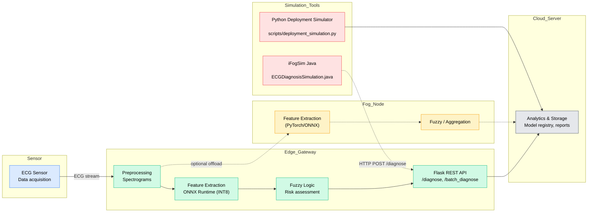

# Architecture Flowcharts

```mermaid
flowchart LR
    subgraph Sensor
        S[ECG Sensor
        Data acquisition]
    end

    subgraph Edge_Gateway
        P[Preprocessing
        Spectrograms]
        FX["Feature Extraction
        ONNX Runtime (INT8)"]
        FU[Fuzzy Logic
        Risk assessment]
        API[Flask REST API
        /diagnose, /batch_diagnose]
    end

    subgraph Fog_Node
        FXF["Feature Extraction
        (PyTorch/ONNX)"]
        FUF[Fuzzy / Aggregation]
    end

    subgraph Cloud_Server
        AN[Analytics & Storage
        Model registry, reports]
    end

    subgraph Simulation_Tools
        SIM[Python Deployment Simulator
        scripts/deployment_simulation.py]
        IFS[iFogSim Java
        ECGDiagnosisSimulation.java]
    end

    S -- ECG stream --> P
    P --> FX
    FX --> FU
    FU --> API
    API --> AN

    P -. optional offload .-> FXF
    FXF -.-> FUF
    FUF -.-> AN

    IFS -. HTTP POST /diagnose .-> API
    SIM --> AN

    %% Distributed Intelligence Theme for Subgraphs
    classDef sensor fill:#dbeafe,stroke:#3b82f6,color:#000;
    classDef edge fill:#d1fae5,stroke:#10b981,color:#000;
    classDef fog fill:#fef3c7,stroke:#f59e0b,color:#000;
    classDef cloud fill:#e5e7eb,stroke:#4b5563,color:#000;
    classDef tools fill:#fee2e2,stroke:#ef4444,color:#000;

    class S sensor
    class P,FX,FU,API edge
    class FXF,FUF fog
    class AN cloud
    class SIM,IFS tools
```

